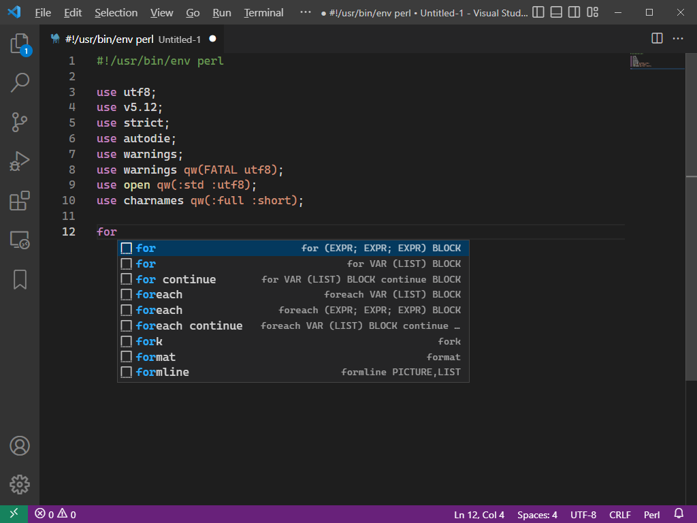

# Perl Completions README

Perl Completions implements code completion for Perl5 via snippets.

All functions and their arguments were extracted from [Alphabetical Listing of Perl Functions](https://perldoc.perl.org/perlfunc#Alphabetical-Listing-of-Perl-Functions).

The flow-control keywords were extracted from [Compound Statements](https://perldoc.perl.org/perlsyn#Compound-Statements).

## Features

- Tab-completion support for Perl5 functions and their arguments.
- Tab-completion support for Perl5 flow-control keywords like `for`, `if`, `while`, ... 

Type the first letters of a function or flow-control keyword and auto-complete will offer some snippets:

Use `TAB` to replace the placeholders like `BLOCK`, `EXPR`, `LIST`, `VAR`, ...: 

Use the keyword `init` for boilerplate of scripts, modules and tests:

## Configuration

Enable it with "editor.tabCompletion": "on".

## Release Notes

### 0.0.2

- Fix issue gh#1

### 0.0.1

- Initial release
